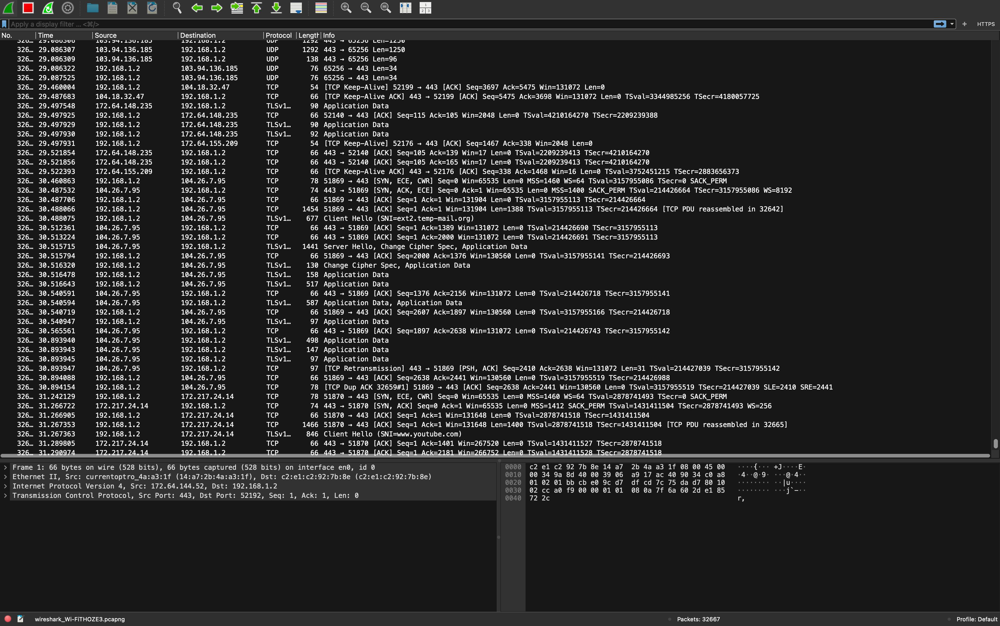

# Wireshark Network Traffic Analysis

## Overview

This repository contains a comprehensive network traffic analysis project using Wireshark. The analysis includes packet capture data, detailed findings, and visual documentation of network traffic patterns and security insights.

## Project Structure

### Network Capture File
- **network_traffic_analysis.pcapng** - The main packet capture file containing the raw network traffic data analyzed in this project. This file can be opened with Wireshark for detailed inspection of packets, protocols, and network flows.

### Analysis Report
- **Wireshark_Network_Traffic_Analysis_Report.pdf** - A comprehensive report documenting the analysis methodology, findings, and insights derived from the network traffic capture. This report includes:
  - Network traffic patterns
  - Protocol analysis
  - Security observations
  - Performance metrics
  - Recommendations and conclusions

### Visual Documentation
- **images/** - Folder containing screenshots and visualizations from the analysis

## Getting Started

### Prerequisites
- [Wireshark](https://www.wireshark.org/download.html) installed on your system
- Basic understanding of networking protocols and packet analysis

### Usage
1. Download the `network_traffic_analysis.pcapng` file
2. Open it with Wireshark
3. Review the analysis report (PDF) for context and findings
4. Explore the packet capture to understand network behavior and patterns

## Key Findings

Refer to the detailed PDF report for comprehensive analysis results, including:
- Traffic volume and patterns
- Protocol distribution
- Source and destination analysis
- Security considerations

## Tools Used
- **Wireshark** - Network protocol analyzer
- Packet capture and deep inspection tools

## About

This project demonstrates practical network traffic analysis skills using industry-standard tools. The analysis focuses on understanding network behavior, identifying patterns, and extracting meaningful insights from packet-level data.
